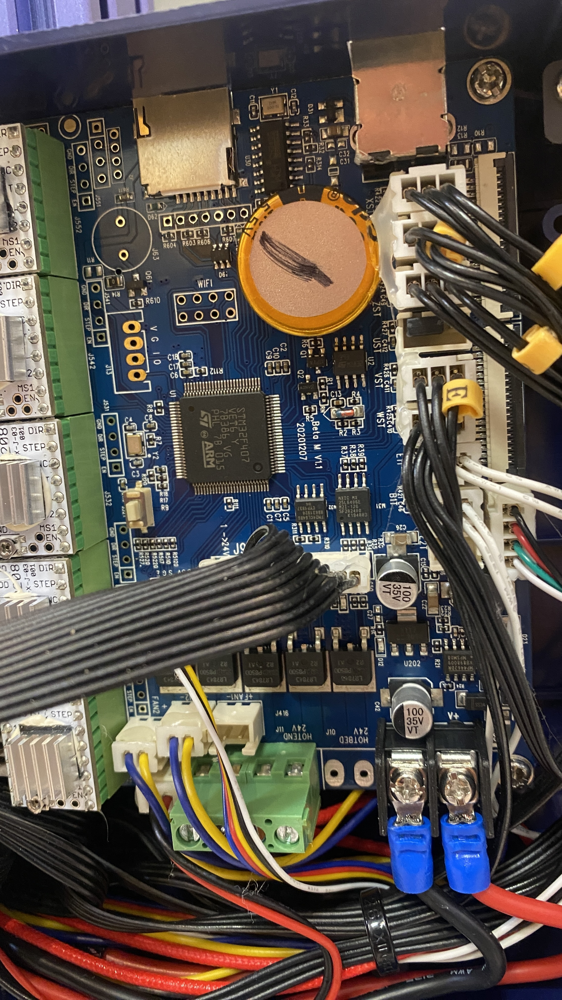

# Lotmaxx Shark V2: Beta M V1.1, Marlin и лазер

Практическая документация по принтеру Lotmaxx Shark V2 с платой **Beta M V1.1**. Цель репозитория - не повторять путь обратной разработки: собрать современный Marlin для STM32F407, сохранить рабочую заводскую конфигурацию и использовать штатную лазерную голову из LightBurn.

## Что подтверждено

- Контроллер: **Beta M V1.1**, маркировка платы `20201207`; MCU `STM32F407VET6` в LQFP100.
- Принтер: один хотэнд, два Bowden-податчика, область печати `250 x 250 x 265` мм.
- Заводской контроллер `SC-10Shark-v1.6` и штатный DWIN V1.6 работают стабильно.
- Лазерная голова с драйвером `SC-60-V2-L-V1.0` работает на заводской прошивке.
- Для Marlin подтверждены питание драйвера `PE9`, разрешение силового каскада `PE12`, PWM `PE13` и focus-концевик `PD9`.
- LightBurn в профиле **Marlin** выдаёт мощность через `M106 S0..255`; для этого требуется специальная обработка в прошивке и синхронизация с движением.

## Сначала прочитать

1. [Состояние и ограничения](docs/STATUS.md) - важные границы применения.
2. [Плата Beta M V1.1](docs/BOARD.md) - проверенная распиновка.
3. [Микроконтроллер STM32F407VET6](docs/MCU_STM32F407VET6.md) - возможности и все 100 физических выводов корпуса.
4. [Лазерная часть](docs/LASER.md) - разъёмы, сигналы и оставшиеся неизвестные.
5. [Драйвер SC-60-V2-L-V1.0](docs/LASER_DRIVER.md) - фото, элементы, питание и план завершения схемы.
6. [Сборка Marlin](docs/MARLIN.md) - что менять и как получить `SM3DP.bin`.
7. [LightBurn](docs/LIGHTBURN.md) - профиль, G-code и команды проверки.
8. [DWIN](docs/DWIN.md) - что оставить штатным и почему.

Краткая английская версия: [README.en.md](README.en.md).

## Быстрый маршрут

1. Сохранить заводской BIN и SD-карту.
2. Сверить, что на плате именно `Beta M V1.1`, а на лазерном драйвере `SC-60-V2-L-V1.0`.
3. Собрать Marlin в окружении `lotmaxx_V1_7` по [инструкции](docs/MARLIN.md).
4. Записать в корень SD один файл `SM3DP.bin`; загрузчик после обновления переименует его в `OLDSM3DP.BIN`.
5. До любого нагрева проверить реальные показания обоих термисторов, концевики и направления осей.
6. Для лазера использовать профиль LightBurn из [LIGHTBURN.md](docs/LIGHTBURN.md), проверяя сначала на расфокусированной голове и негорючей поверхности.

## Структура

- `docs/` - проверенные сведения и повторяемые процедуры.
- `assets/` - фото идентификации и размеченная фотография драйвера без GPS/EXIF-метаданных.
- `firmware/` - экспериментальная сборка Marlin, а также отдельно заводской контроллерный образ V1.6.
- `dwin/DWIN_SET/` - штатные рабочие ресурсы экрана V1.6 для восстановления.

В репозитории намеренно нет экспериментальных DWIN-пакетов и диагностических BIN. Вложенная прошивка Marlin отмечена как экспериментальная: обходы термозащиты не являются переносимым решением для другого принтера.
