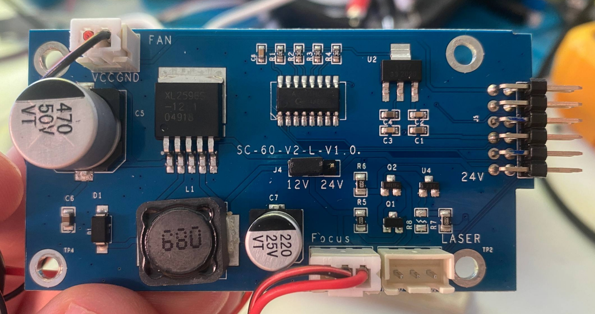

# Драйвер лазера SC-60-V2-L-V1.0



Это отдельная плата между Beta M V1.1 и лазерной головой. На ней **нет отдельного микроконтроллера**: единственная цифровая микросхема `74HC165` - параллельно-последовательный регистр входов. Управление логикой и мощностью приходит с Beta M.

## Наблюдаемая структура

| Обозначение | Что установлено | Подтверждённая роль |
|---|---|---|
| `J3` | 12-контактная гребёнка | Связь с Beta M: питание, focus, PWM и интерфейс `74HC165` |
| `FAN` | 2 контакта, `VCC GND` | Вентилятор драйвера; питается от 24 V, когда `PE9` включает вторую силовую ступень Beta M |
| `FOCUS` | 2-контактный разъём | Концевик фокуса; на Beta M это `PD9`, active-low |
| `LASER` | 3-контактный разъём | Лазерная голова: постоянные 12 V, PWM и переключаемая земля |
| `J4` | перемычка `12V / 24V` | Аппаратный выбор питающего напряжения лазерной головы; на исследованном модуле наблюдались 12 V |
| `U1` | XL2596S | Понижающий DC-DC преобразователь, формирует питание головы после J4 |
| `U2` | AMS1117-3.3 | 3.3 V для цифровой части; не путать с измеренной 5 V шиной |
| `74HC165` | SO-16 | Считывает параллельные входы головы/драйвера в Beta M |
| `Q1`, `Q2`, `U4` | SOT-23 компоненты | Вероятный каскад управления low-side `LASER GND`; точная схема не завершена |
| `R1-R4` | 10 kOhm | Подтяжки цифровой части |
| `R5` | `2001`, 2 kOhm | Обвязка транзисторного каскада |
| `R6` | `2002`, 20 kOhm | Обвязка транзисторного каскада |
| `R7` | `2203`, 220 kOhm | Обвязка транзисторного каскада |

Маркировки малых SOT-23-компонентов с фотографии недостаточны для надёжной идентификации. Не заменяйте их на основании короткой маркировки без электрической проверки.

## Питание

```text
Beta M PE9 -> MOSFET #2 -> 24 V -> FAN1 -> вход SC-60
24 V -> U1 XL2596S -> J4 -> 12 V для лазерной головы
5 V -> U2 AMS1117-3.3 -> 3.3 V логики
```

У разъёма `FAN` подтверждены контакты `GND` и +24 V. Вентилятор вращается, когда `PE9` включил питание драйвера. Это не означает включение оптического луча.

## Лазерная голова

На трёхконтактном разъёме головы присутствуют:

| Линия | OFF | ON | Значение |
|---|---|---|---|
| Питание | около 12 V | около 12 V | Питание головы постоянно при активном драйвере |
| PWM | PWM на `PE13` | PWM на `PE13` | Рабочая несущая, на стоке около 1 kHz |
| GND | не замкнута на общую землю | подтянута к общей земле | Фактическое разрешение лазерной головы |

Следовательно, один только PWM не достаточен для доказательства включения. В рабочем пути Marlin требуются одновременно `PE9` (24 V драйвера), `PE12` (разрешение каскада) и ненулевой PWM `PE13`. Линия `PE3` также идёт к драйверу как active-low Laser Enable, но её роль внутри SC-60 ещё не доказана.

## J3: связь с Beta M

Полная сверенная таблица: [LASER.md](LASER.md#линейная-12-контактная-гребёнка-драйвера).

Ключевые линии:

```text
J3-1  <-> PD9   focus switch
J3-2  <-> PE3   Laser Enable, active-low
J3-4  <-> PD8   /PL 74HC165
J3-6  <-> PE14  CLK 74HC165
J3-8  <-> PE13  laser PWM
```

`PE15` читает `Q7` регистра `74HC165` через 2x6-разъём Beta M (контакт 9). Таблица питания и этой части шлейфа приведена в [LASER.md](LASER.md).

## Что ещё нужно прозвонить

Для завершения принципиальной схемы не хватает именно силового участка включения луча:

1. От `LASER GND` трёхконтактного разъёма до всех площадок `Q1`, `Q2`, `U4`.
2. От контакта 2 силового ряда 2x6 Beta M до того же узла. Он измерялся как 21.5 V при OFF и 0 V при ON.
3. Вторые выводы `R5-R8` до Q1/Q2/U4, чтобы определить затворы/базы и подтяжки.
4. `74HC165`: D6 (вывод 5), `DS` (10), `/CE` (15), D0-D3 (11-14).

## Безопасный измерительный порядок

1. Отключить лазерную голову; вентилятор и логика драйвера могут остаться подключёнными.
2. На выключенном устройстве прозванивать только относительно общей GND.
3. На включённом устройстве сначала сравнить стоковую прошивку OFF/ON мультиметром; осциллограф использовать на PWM.
4. Не соединять неизвестные сигнальные линии с GND или +3.3/+5 V напрямую.

Полная система сигналов и её программное использование описаны в [LASER.md](LASER.md) и [MARLIN.md](MARLIN.md).
