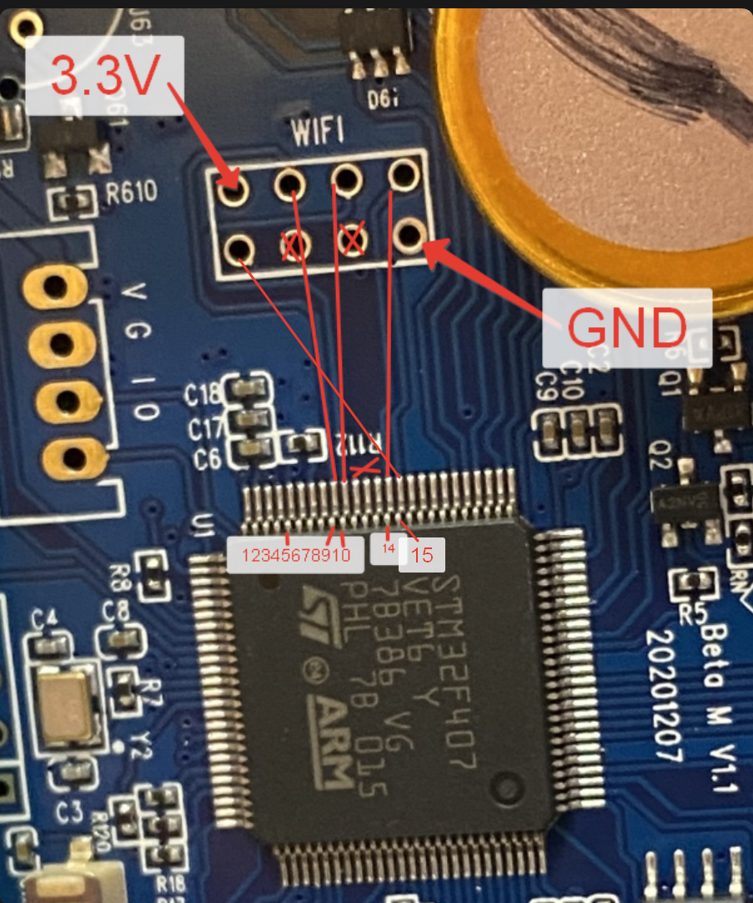

# Разъём WIFI Beta M V1.1



На Beta M V1.1 предусмотрена незапаянная площадка `WIFI`: двухрядный разъём на 8 контактов. Заводской модуль в исследованном принтере отсутствовал. Поэтому это документация по площадке и её измеренным шинам, а не готовая инструкция по подключению конкретного ESP-модуля.

## Что известно

- Верхний левый контакт имеет **3.3 V**.
- Нижний правый контакт имеет **GND**.
- На фотографии видны дорожки от четырёх сигнальных площадок к стороне MCU. Две средние площадки нижнего ряда не имеют видимой дорожки на этой стороне платы, но это не доказывает отсутствие электрического соединения: дорожка может быть на внутреннем или обратном слое.
- В доступных исходниках заводского образа и текущей Marlin-конфигурации нет распиновки Wi-Fi именно для `Beta M V1.1`; `WIFISUPPORT` не включён. Тип штатного модуля, протокол и конкретные `TX`/`RX` пока не установлены.

Не подавайте на этот разъём 5 V. Даже если модуль окажется совместимым с UART, питание и логические уровни здесь должны быть 3.3 V.

## Нумерация и предполагаемое применение

Нумерация ниже введена для документации. Вид - как на фотографии: над верхним рядом надпись `WIFI`, плата ориентирована так же, как на изображении. Отсчёт начинается с нижнего левого контакта и идёт **по часовой стрелке**.

```text
            надпись WIFI
          8     7     6     5
          1     2     3     4
```

| Контакт | Статус линии | Что известно | Предполагаемое применение |
|---:|---|---|---|
| `1` | сигнал | Видна дорожка к стороне MCU | Резервный GPIO или управляющая линия Wi-Fi-модуля |
| `2` | неизвестно | На показанной стороне явной дорожки не видно | Не использовать до прозвонки |
| `3` | неизвестно | На показанной стороне явной дорожки не видно | Не использовать до прозвонки |
| `4` | питание | GND | Земля |
| `5` | сигнал | Видна дорожка к стороне MCU | Одна из трёх линий внешнего интерфейса: `TX`, `RX` или `EN/RST` после прозвонки |
| `6` | сигнал | Видна дорожка к стороне MCU | Одна из трёх линий внешнего интерфейса: `TX`, `RX` или `EN/RST` после прозвонки |
| `7` | сигнал | Видна дорожка к стороне MCU | Одна из трёх линий внешнего интерфейса: `TX`, `RX` или `EN/RST` после прозвонки |
| `8` | питание | 3.3 V | Питание Wi-Fi-модуля |

Посадочное место размером 2x4 и диагональные `3.3 V`/GND совместимы с идеей ESP-01, но это только гипотеза по форм-фактору. Она не доказывает порядок `TX`, `RX`, `EN`, `RST`, `GPIO0` или `GPIO2`.

## Рекомендуемый 5-контактный вывод

Для первого переходника следует вывести не неизвестные `2`/`3`, а пять контактов по внешнему контуру колодки:

```text
Переходник 1: 3.3V  <- WIFI-8
Переходник 2: SIG-A <- WIFI-7
Переходник 3: SIG-B <- WIFI-6
Переходник 4: SIG-C <- WIFI-5
Переходник 5: GND   <- WIFI-4
```

Это даёт питание, землю и все три подтверждённо разведённые сигнальные площадки верхнего ряда. До прозвонки подписывать `SIG-A/B/C` как `TX`, `RX` или `EN` нельзя. Контакт `1` стоит оставить доступным тестовой площадкой: он тоже имеет видимую дорожку и может оказаться четвёртым сервисным сигналом.

Красные пометки `1...15` на исходной фотографии помогают найти зону выводов корпуса, но сами по себе не являются достаточной прозвонкой. Поэтому в [таблице всех ножек MCU](MCU_STM32F407VET6.md) не добавлены вымышленные назначения для Wi-Fi.

## Что нужно измерить

Проверять только на обесточенной плате, мультиметром в режиме прозвонки или малого сопротивления.

1. Подтвердить `8` до шины 3.3 V и `4` до GND.
2. Для `1`, `2`, `3`, `5`, `6`, `7` зафиксировать точную ножку STM32F407VET6 или иной узел платы.
3. После прозвонки сопоставить найденные GPIO с физической таблицей MCU и определить, образуют ли две линии штатную UART-пару.
4. Только затем выбирать модуль и прошивку. Для UART-модуля нужны как минимум `3.3 V`, `GND`, `TX`, `RX`; дополнительные линии могут быть `EN`, `RST`, `GPIO0` либо неиспользуемыми.

До этой проверки нельзя подключать ESP-01, ESP8266 или другой модуль «по типовой распиновке»: одинаковая колодка не гарантирует одинаковый порядок сигналов.

## Следующий результат, который нужен репозиторию

Для каждого из шести непроверенных контактов достаточно записи вида: `7 -> STM32 <порт/номер>`, либо `2 -> NC/GND/3.3V`. После этого карту можно перенести в [MCU_STM32F407VET6.md](MCU_STM32F407VET6.md) и подготовить безопасную конфигурацию для конкретного Wi-Fi-модуля.
